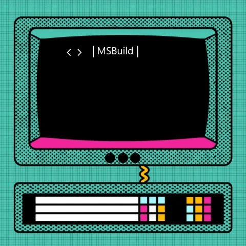

### Olá, eu sou Vinícius! 

Me chamo Vinícius Pinheiro e sou estudante de desenvolvimento Front-End. Possuo bacharelado em Cinema e Audiovisual e formação em Design Gráfico, o que me possibilita o manuseio de diversos tipos de mídias durante o ato de programar. 

Atualmente, busco, cada vez mais, aperfeiçoamento para tornar-me um profissional qualificado para a carreira de tecnologia.

### Estudos:
>Meu foco é no Front, por isso meus estudos atuais estão focados nas seguintes tecnologias: 

   

 

<!--
**Vi-Pinheiro/vi-pinheiro** is a ✨ _special_ ✨ repository because its `README.md` (this file) appears on your GitHub profile.

Here are some ideas to get you started:

- 🔭 I’m currently working on ...
- 🌱 I’m currently learning ...
- 👯 I’m looking to collaborate on ...
- 🤔 I’m looking for help with ...
- 💬 Ask me about ...
- 📫 How to reach me: ...
- 😄 Pronouns: ...
- ⚡ Fun fact: ...
-->
